# CART 470 Journal Fall 2026

## Journal Entry 01 | Week 02 Organization and Planning

### Group Formation and Project Assigning

After the lecture, the team came together having been officially assigned. I was pleased to see that everyone who I had spoken to about working with last class had been added to the team. However, it was interesting to see that due to the fact that our first choice project had been cancelled, we were instead assigned a project which we actually had not previously considered working on, which was Pippin Barr's Game Education Software. 

The design problem is as follows:

"How can we create an interface that allows editing and playing of a simple pre-existing

game (e.g. Pong). The editing should allow a sufficient breadth of expressive possibilities

that users can come up with genuinely diverse outcomes (e.g. aesthetics, mechanics,

physics, sound design, etc.)"

I was actually quite pleased with this concept, as it seems to allow for the use of the variety of skills that we have in our group while also seeming to allow the flexibility for creative design. Furthermore, I and everyone else on the team are all familiar with Pippin Barr as a professor, and are looking forward to working with him as a client. 

### Planning

Pippin Barr's expected outcome for the project actually seemed quite small in terms of scope, expecting only an interactive UI interface in a software like Figma. However, my team is confident that our combined skills can go beyond this small scope, and that we could push the project past just a design and create a working prototype as well. In order to begin, we created a Figjam file using Figma, creating a digital version of the sticky note method of planning discussed during the lecture. Our goals with this exercise was to 1. Organize ourselves as a team, asking ourselves what kind of tasks would each member be willing to do, while also getting an idea of wat kind of tasks and tools would be needed. 2. Determine what kind of questions to ask to the client when meeting him to better know the project and 3. To present ideas in order to guide the conversation.

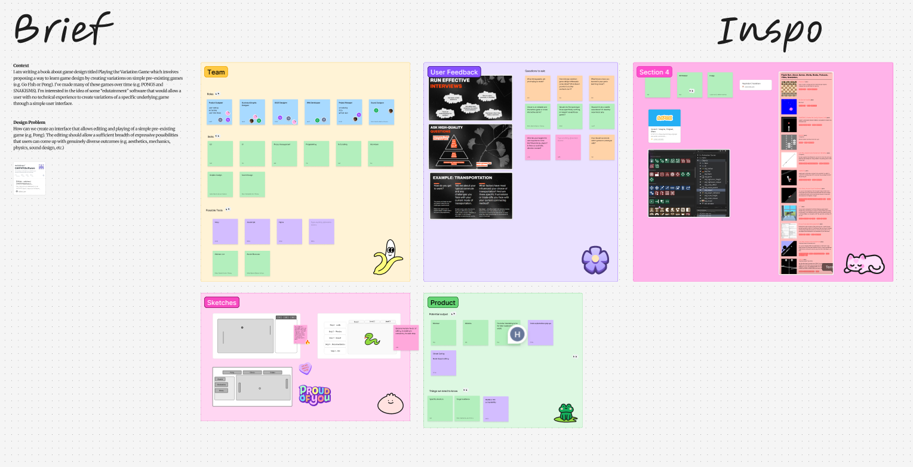
A screenshot of the whole Figjam board.

To begin, we organized ourselves as a team, creating possible roles that might need to be filled like a product designer, illustrator and web-developper. We then placed our names over the roles which we felt comfortable doing. This started a thinking process about all of our combined skills, which we wrote  below, and possible tools. Not only did this help us start thinking about what working on this project might be like, but it also helped us get to know everyone on the team better.

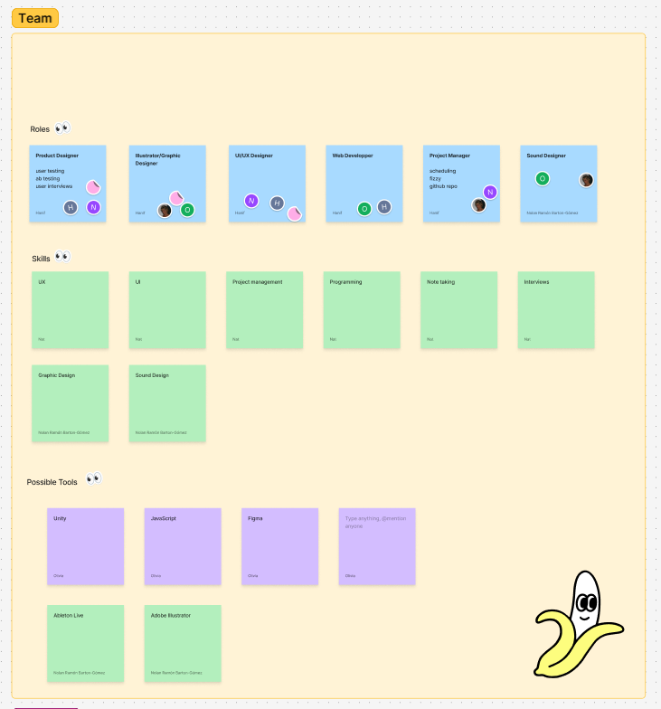

The next logical thing was to begin gathering inspiration by looking at similar programs to that which we are assigned to make. We looked at game engines which are often sighted as being user friendly, like GameMaker, RPGMaker and Scratch sighting especially the 'block code' format that GameMaker has the option to use, which allows a user to avoid text-based coding altogether if they so wish. We also gathered Pippin Barr's own games as reference, trying to gain familiarity with the client's work in order to get a better idea of the style and complexity of the project. While brainstorming, we also created an adjacent board which brings up questions to ask during next week's client meeting in order to see how these inspirations line up with Pippin Barr's view.

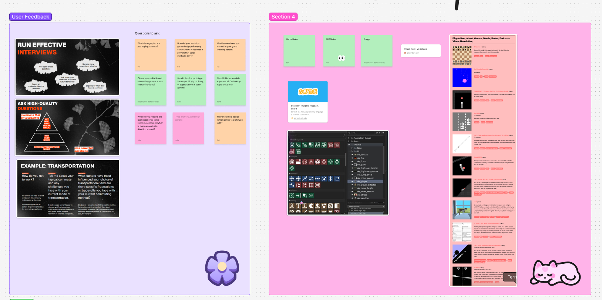

Finally, we did some simple sketches outlining possible product outcomes, showing potential UI layouts and project functionality, pairing this with a Product board where we brainstormed further on the main aspects of the final product such as the fact that it could be hosted on a website, have a modular take on game-making and guide a user through explanations of the functions.

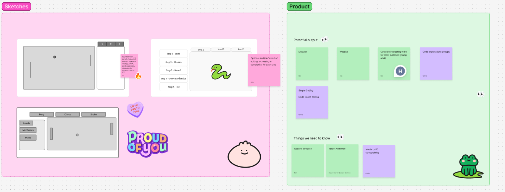

### Moving Forward

It's difficult to know at the moment exactly which direction this project will take, given that we haven't met with the client yet. However, I am confident that we prepared well for the meeting, meaning that it will be very productive in determining the scope and style of the final project. For now, the next steps rely on more ideation and design processes.

### Journal Entry 02 | Week 03 Consultation and Ideation

### Meeting with the Client, Pippin Barr

Our meeting with Pippin Barr was productive and, and the same time, surprising. While I knew his project proposal hinged on the idea of ideation and of pushing the creative limits of the players, I did not expect him to intend for the design itself to include these values within its own design. After our meeting with him, it was clear that we would need to bring the ideaology of "radical ideation" to our own work as well. 

Despite this, I am pleased with the idea that the design process itself should be more fun and unexpected rather than focusing on creating a straigthforward more 'academic' style tool for teaching game design. Pippin stressed that the tool should be designed with his students in mind (University level individuals who are new to game design) but could still be playful and accessible even to young children. In fact, he even cited the early KidPix drawing software as a reference.

 It is important to note that while Pippin seemed to have a specific vision in mind, he seemed glad to let us pitch in our own unique ideas and visions to the project. As well, it is also important to note that the final product expected for his project does NOT have to be a finalized application, rather, he is seeking to use our design process and the prototype we create as material for his book on game design which he is currently writing. 

#### Main takeaways:
- Rather than seeking to create a finalized application, our focus should be more on unexpected design and ideation (we should not sacrifice interesting design ideas for feasibility)
- The design should be universaly appealing to University students as well as a potentially younger audience
- The design should encourage "radical ideation" and breaking from the usual game-making conventions
- It should have the aim of making game-making fun instead of purely academic
- The interface should be easy to understand and useable even to those who have no experience with coding

### Ideation
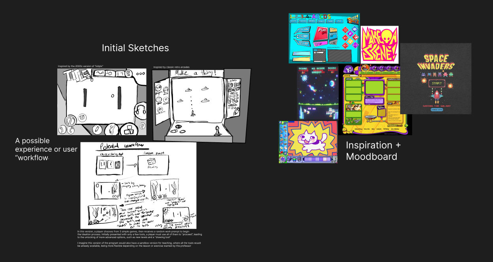
To begin the design process this week, I decided to start small, collecting references and doing quick sketches. At this stage, I believe that rough ideas are more productive tothe ideation process, rather than creating fully coloured and rendered prototype images. I placed all my work into one Figma project witht he intent of using the same file throughout the whole semester.
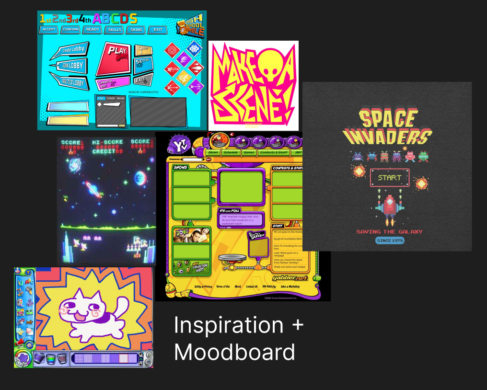
When collecting references, I referred back to our conversation with Pippin. My search began with KidPix (bottom left) and branched off from there. The version of KidPIx that I remember using as a child is undoubtedly different than that Pippin remembers, but it still seems to hold a playful, "wacky" design style that encourages creations which reflect these ideas. I searched for images with energy; bright colors, irregular shapes and unconventional design. I also ended up adding some more 'classic' arcade imagery as I came to the realization that the design elements I was looking for could be found in this more familiar visual language.
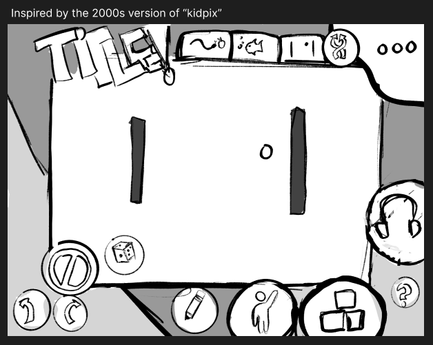
My first design was more heavily inspired by the KidPix reference, and leaned into the early 90s to 2000s "Wacky Pomo" or "Wacky Postmodernism" design. This style I associate with all of the energy, creativity and elements of the unexpected that would fit right in to the values that Pippin Barr would like to see in this project. I aimed to make the buttons clear while using a sort of 'floating bubble' idea to literally free them from conventinality (as buttons are often organized in neat rows or columns). This design has features such as a simple physics editor, a sound and music changer, an ability to add characters or "actors" and the ability to choose a base game, which can also be 'mashed' with another. Furthermore, the "randomize" button, represented by a dice, would allow for further exploration into the unexpected.
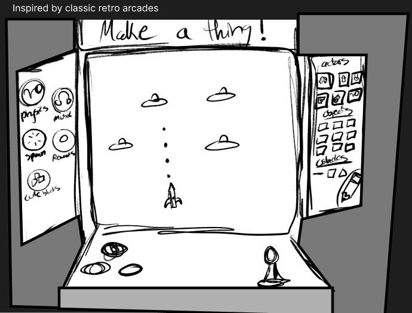
My next design, as shown above, leans a little more into conventionality, but still aims to bring a similar energy to the experience. The function buttons are on the side and on the base of the arcade machine, creating a skeumorphic representation of the functions. To most people, Arcade games are associated with simple games, so I imagine that the idea of creating based off of a classic like "Space Inavders" or "Snake" within the context of an actual Arcade machine might be intriguing while not being daunting. This interface still holds the same functions as the previous one, including the ability to randomize and add elements to the game at will. It is also worht mentioning that both designs have a "draw" function, which would allow a user to use a simple pencil tool to draw obstacles, sprites and other types of game objects directly to the canvas.
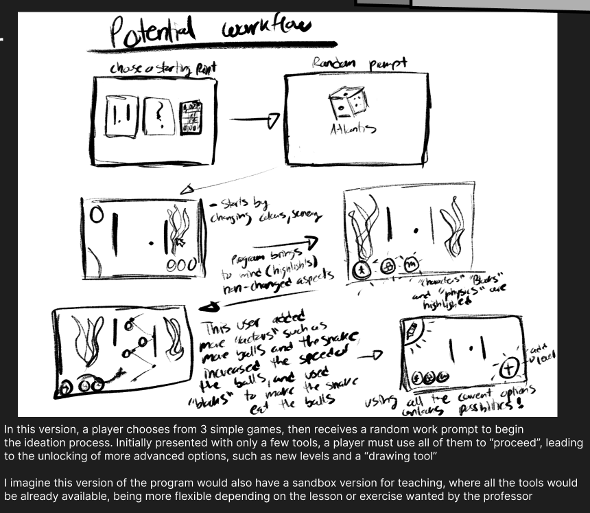
Finally, I came up with an idea of a "workflow" or "userflow" that could be implemented to encourage creativity in a more game-like and reward based manner.  as worded in my image decsription:
" a player chooses from 3 simple games, then receives a random work prompt to begin
the ideation process. Initially presented with only a few tools, a player must use all of them to proceed, leading 
to the unlocking of more advanced options, such as new levels and a drawing tool.
I imagine this version of the program would also have a sandbox version for teaching, where all the tools would be already available, being flexible for the  lessons or exercises wanted by the professor."

### Moving Forward
Between my ideas and those that will be presented by my other teams memebers this week, it will be most important to focus down all of our ideas into a few key elements and values. It will be interesting to see how similar or different our ideas are, and which new elements I haven't even thought about are brought to the pool of ideas. For next week, I think it'll be most productive to come up with a list that we all agree on, and to create a few, more refined, designs which best represent these design values.

### Journal Entry 03 | Week 04 Developing Concepts

### Group Work Overview
For this week, we started developing on a program idea that was a blend of the main user game editing techniques we discussed together, which was a node-based editor,a slider based editor and a drag-and-drop based editor. In this version, a user still picks a base game to edit, changing its functionality by adding nodes. These nodes come in different easy to understand categories, like aesthetics, mechanics and story which contain within them sliders, drag-and-drop functionality, and editable variables.
Group members divided the tasks (userflow, wireframe and visual concepts) in pairs, with Julia and I deciding to develop visual concepts. We also decided to create a shared, ongoing moodboard so that members could continuously share ideas and stay acquainted with the energy and style of the project.
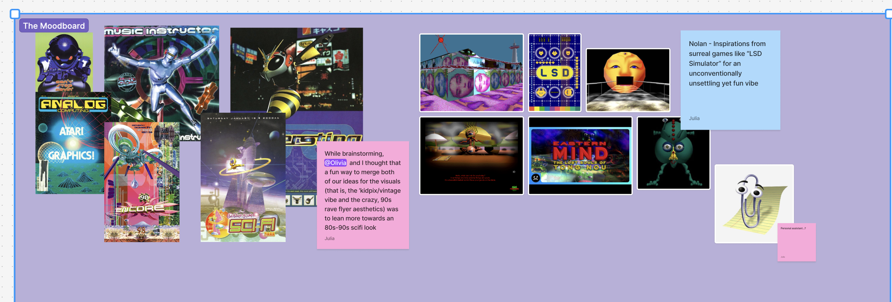
The ongoing moodboard.

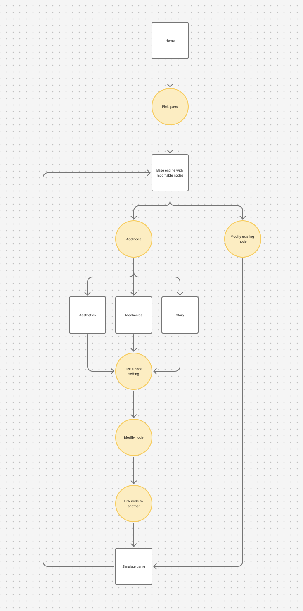
The userflow chart demonstrating the nodes functionality.

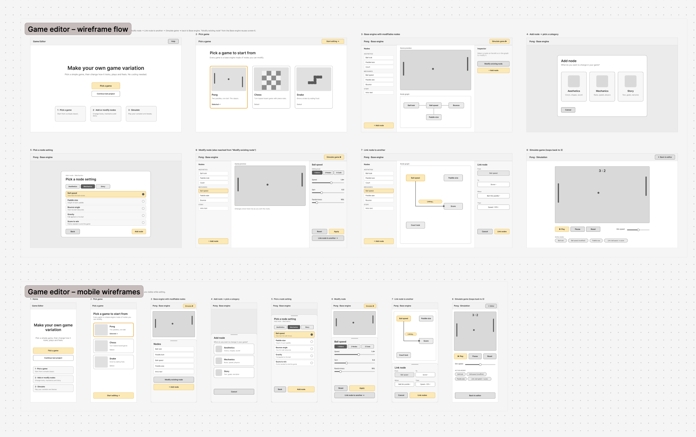
A detailed wireframe showing both a potential PC and Mobile version of the program.

### Design Concepts
The design concepts that Julia and I worked on were heavily based on my sketches from last week, especially the arcade and the "wacky" designs which are directly based off of them. The "sci-fi" designs leans more heavily into Julia's photobash concepts based off of early-2000s MP3 players. We wanted to explore the possibilities behind each idea, and see clearly how these might look in a more high-definition version in order to decide on which would suit the program best. All of these concepts have collpasible windows which would expose the details of the tools and node editor once one was selected.
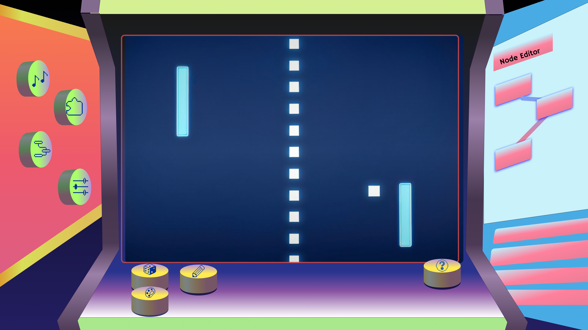
The Arcade Concept.

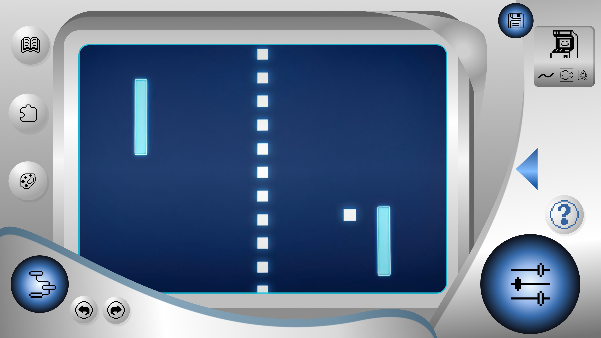
The Sci-Fi Concept.

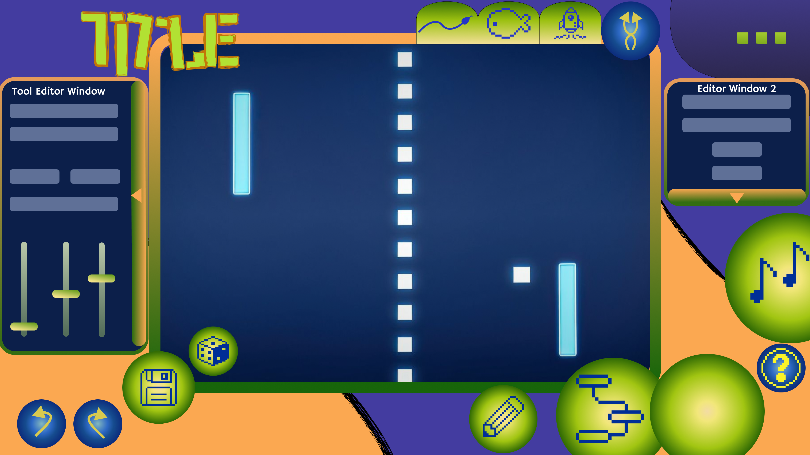
The Wacky Concept.

While each concept is unique in their design, we focused on still bringing in the energy of the moodboard, while balancing Pippin's emphasis on "radical experimentation" with interface readability. In my opinion, the two most successful designs in these aspects are the Sci-fi and Wacky designs, with the Arcade pitch being particularly striking visually, but posing more design challenges in user readability due to the dramatic skeumorphic perspective on the buttons and editing window.

### Moving Forward
For next week, we absolutely should choose one concept to finally start development on the prototype. Right now, we have three strong visual concepts,a userflow and a detailed wireframe to start from, so all that is missing is Pippin's input. I am looking forward to showing our client the concepts we've developed over the past couple of weeks, however, at this moment he is not responding to our resquests to meet. Hopefully he responds soon, as I am keen on beginning further development.